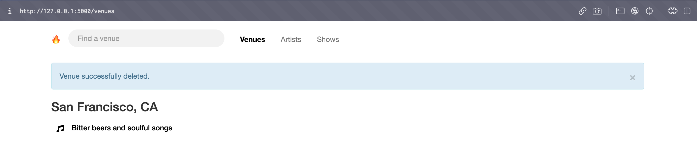

Fyyur Shows website
-----

## Introduction

Fyyur is a musical venue and artist booking site that facilitates the discovery and bookings of shows between local performing artists and venues. This site lets you list new artists and venues, discover them, and list shows with artists as a venue owner.

This app uses the following tools: 

- Python 3.10.9
- Flask 
- SQLAlchemy ORM 
- Postgres and Flask Migrate 
- HTML and CSS for the front end

## Project overview

Overall:
* Models are located in `models.py`.
* Controllers and the app's routes are located in `app.py`.
* The web frontend is located in `templates/`, which builds static assets deployed to the web server at `static/`.
* Web forms for creating data are located in `forms.py`.

Main folders:

* `templates/pages`: Defines the pages that are rendered to the site. These templates render views based on data passed into the template’s view, in the controllers defined in `app.py`. These pages successfully represent the data to the user, and are already defined for you.
* `templates/layouts`: Defines the layout that a page can be contained in to define footer and header code for a given page.
* `templates/forms`: Defines the forms used to create new artists, shows, and venues.
* `app.py`: Defines routes that match the user’s URL, and controllers which handle data and renders views to the user. This is the main file you will be working on to connect to and manipulate the database and render views with data to the user, based on the URL.
* `models.py`: Defines the data models that set up the database tables.
* `config.py`: Stores configuration variables and instructions, separate from the main application code. This is where you will need to connect to the database.

## Demo
### Setup 

To set up, clone this repo and create a virtual environment and install the dependencies in `requirements.txt`, e.g 

```
# Create venv
python3 -m venv fyyur_venv
source fyyur_venv/bin/activate

# Navigate to base directory and install requirements
cd flask_fyyur/
pip3 install -r requirements.txt
```

Additionally, we need to install node and Bootstrap 3. I used brew for node:

```
brew install node
# verify installation by running node -v
npm init -y
npm install bootstrap@3
```

Finally, we need to connect to our database. I prefer Docker to running local Postgres servers. To create a Postgres container with the following details:

- username: `postgres`
- password: `postgres`
- database name: `fyyur`
- hostname and port: `localhost:5432`

Run

`docker run -p 5432:5432 -e POSTGRES_PASSWORD=postgres -e POSTGRES_DB=fyyur --rm postgres`

Note, if you change this config, the database URI in `config.py` will need to be changed. Also note that when you stop the container, it will be removed. If you do not want this behaviour, remove the `--rm` flag.

Now check whether you can run the app by running `python3 app.py` from `flask_fyyur`. Also see if you can connect to your database, e.g. in DBeaver. 

We should see the following homepage on `127.0.0.1:5000`:


And a blank database called `fyyur` on `localhost:5432`:


If that's all working, you can apply the migrations in the `migrations/` by running  `flask db upgrade`. We should see some empty tables coming up in our `public` schema:


### Website walkthrough
Now we're all set up, let's walk through the available functionality!

#### Creating new objects
We can submit new artists, venues, and shows. The models are set up so that every show will be related to a venue and an artist, and every venue and artist can be related to multiple shows (i.e. a 1:N relationship between artist-show and venue-show). 

To demonstrate, let's create a new venue, artist, and show. First, we'll create a new artist, by clicking on the `Post an artist` button on the homepage.

We can populate all the fields with some example data and hit Create. We should see a notification saying our new artist has been created:


We can see a record populating in the database:


We'll go through a similar process to create our first venue. We'll now have an artist with ID 1 and a venue with ID 1. 

We can now go to Post a show and create a show for this artist at this venue. In fact, we'll create one past show and one upcoming show just to demonstrate the functionality.

### Listing objects
We can now list our artists, shows, and venues either by navigating from the home page or by clicking in the nav bar at the top. We can see our venues grouped by city and state:


And, clicking on our new venue, we can see the genres they play, location, whether they're seeking talent, a picture of the venue, and their past and upcoming shows (past did not fit on my screen, but it's there!)


Navigating to our artists, we see a similar list that we can click through to:


And now we can see more details about the artist, and their upcoming shows, similar to the venue page:


Finally, going to the show page, we see one past show and one upcoming (today is August 18th):


### Searching objects
On the venue and artist tabs, there is also search implemented, which is case-insensitive and also works for partial matches:


### Deleting venues
Finally, it's also possible to delete venues, but only if they don't have shows listed on them. For example, the Pizza and Music Bar does not have listed shows:


When we click Delete, we see a message popping up saying the venue has been deleted, and it no longer shows up on our list of venues:

